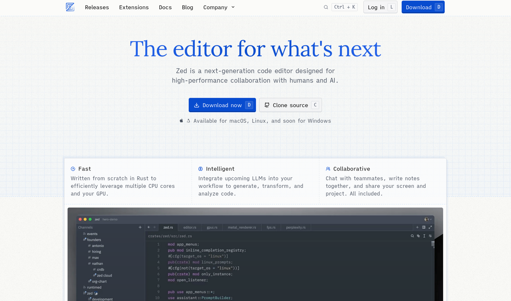

# zed-config

👉 English | [简体中文](README_CN.md)



- [I. What is Zed? 🧐](#i-what-is-zed-)
- [II. Why Choose Zed? 😎](#ii-why-choose-zed-)
  - [1. Fast ⚡](#1-fast-)
  - [2. Intelligent 💻](#2-intelligent-)
  - [3. Collaborative 📶](#3-collaborative-)
- [III. How to Use Zed? 😉](#iii-how-to-use-zed-)
  - [1. Quick Start 📝](#1-quick-start-)
  - [2. Custom Configuration ✍️](#2-custom-configuration-️)
    - [Vim Mode](#vim-mode)
    - [Proxy](#proxy)
    - [Theme Configuration](#theme-configuration)
    - [Appearance Configuration](#appearance-configuration)
    - [Basic Configuration](#basic-configuration)
    - [Development Configuration](#development-configuration)
    - [Telemetry Settings](#telemetry-settings)
  - [3. Shortcuts ⌨️](#3-shortcuts-️)
    - [System Default Shortcuts](#system-default-shortcuts)
    - [Custom Shortcuts](#custom-shortcuts)
    - [Built-in Vim Mode](#built-in-vim-mode)
    - [Shortcut Overview](#shortcut-overview)
- [IV. Using AI 🌟](#iv-using-ai-)
  - [1. Supermaven Intelligent Completion ✨](#1-supermaven-intelligent-completion-)
  - [2. AI Assistant ⭐](#2-ai-assistant-)
    - [How to Enable Zed AI?](#how-to-enable-zed-ai)
    - [Assistant Panel](#assistant-panel)
    - [Prompting](#prompting)
- [V. Collaboration 💥](#v-collaboration-)
- [VI. Plugin Marketplace 🔌](#vi-plugin-marketplace-)


# I. What is Zed? 🧐

> Zed is a next-generation code editor designed for high-performance collaboration with humans and AI.

Zed Editor is a code editor that supports real-time collaboration, developed by Nathan Sobo, who was previously known for creating the Atom text editor while working at GitHub. Built with Rust at its core, Zed is designed for "high performance" 😮, excelling in areas such as input latency, startup time, and memory usage.

Zed Editor enters the scene with a fresh visual appeal, aiming to provide developers with an efficient, smooth, and intuitive 👍 programming environment.

> Founder Nathan's Views in the Interview 💭:
>
> "My dream tool needs to be both powerful and have a sleek, minimalist appearance, and it must run incredibly fast. However, achieving both ultra-fast speed and powerful functionality is challenging. I can say that most of my career has been spent trying to combine these two aspects, which is precisely Zed's goal. At the same time, we tend to adhere to minimalism in user experience."
>
> "I don't want to replace the command line experience with buttons; that doesn't make sense to me. I like being close to the machine, communicating with it in a language-like manner. I hope the IDE can recognize the existence of the terminal and command line and integrate them cleanly, rather than trying to define everything in a visual interface. As a natural extension and complement to the Unix philosophy, I think this suits me better. However, if I can run tests with a shortcut key instead of switching to the terminal, pressing the up arrow, and then Enter, I would gladly accept it. But I don't want it to hide the essence, because it's essentially running a command."
>
> "My goal has always been to create a lightweight, minimalist product that feels like a text editor but has the powerful features of an IDE, avoiding the laggy experience and bulky UI. This is what I wanted from the very beginning, and it should also be extensible."

# II. Why Choose Zed? 😎

## 1. Fast ⚡

Zed Editor's lightweight design enables quick startup, making it an ideal choice for efficiency-focused developers. It emphasizes simplicity, focusing on speed and optimized resource usage, ensuring easy adoption without complex configurations. At the same time, it offers extensive customization options to meet the advanced needs of power users.

## 2. Intelligent 💻

Zed Editor integrates AI-assisted coding features, enhancing the development experience by making it smarter and more efficient. Whether it's code completion, error detection, or automated refactoring, AI supports you at every step of your coding process. This intelligent assistance not only speeds up development but also reduces errors and repetitive tasks in manual coding.

## 3. Collaborative 📶

Zed Editor's most modern feature is its support for team collaboration. By using Channels and CRDTs, it allows multiple developers to work on the same file simultaneously, facilitating real-time communication and collaboration within the development team.

# III. How to Use Zed? 😉

## 1. Quick Start 📝

Zed Editor currently supports MacOS and Linux systems, with official Windows support coming soon! On Mac, Zed supports versions from Catalina (10.15) to Sonoma (14.x). For Linux, you'll need to install the necessary dependencies—check out the [System Requirements - Zed](https://zed.dev/docs/system-requirements) for more details.

👉 [Install Zed on Linux](https://zed.dev/docs/linux)

👉 [Install Zed on Mac](https://zed.dev/docs/getting-started)

The official Windows version of Zed Editor hasn't been released yet.

However, there are a few ways to use Zed on Windows:

1. Compile it yourself or use a precompiled version from others.
2. Use WSL (Windows Subsystem for Linux) to run the Linux version of Zed Editor within WSL.

## 2. Custom Configuration ✍️

👉 Official Guide: [Configuring Zed - Zed](https://zed.dev/docs/configuring-zed)

👉 Default Settings: [zed/assets/settings/default.json](https://github.com/pjlast/zed/blob/3273f5e4041f67b6703c07a14a1a106c03e36962/assets/settings/default.json)

To open the `settings.json` file, you have two options:

1. Use the shortcut `Ctrl ,`
2. Open the command palette with `Ctrl Shift P` and type `zed: open settings` to open the `settings.json` file

### Vim Mode

Zed Editor has built-in support for Vim mode. To enable it, add `"vim_mode": true,` to the `settings.json` file.

### Proxy

To set up a proxy, add `"proxy": "http://127.0.0.1:7890",` to the `settings.json` file. This will facilitate the use of Zed AI. After making changes, close and restart Zed Editor to apply the new proxy settings.

### Theme Configuration

👉 Explore different themes: [Zed themes](https://zedz.dev/themes)

1. You can preview built-in themes via the `Theme` option in the dropdown menu under your avatar in the top-right corner.
2. To install theme plugins, go to `Extension` under the same menu. For instance, you can install the `base16` plugin and select the `snazzy` theme.
3. To customize themes, place a theme JSON file (like `zedspace.json` from [GitHub - Brunowilliang/zedspace](https://github.com/Brunowilliang/zedspace)) under `.config/zed/themes/`. Then, add the following to your `settings.json` file:

```json
// Change the theme name
"theme": {
    "mode": "dark",
    "light": "One Light",
    "dark": "ZedSpace Dark Theme"
},
```

👉 For more configuration options, check out the official guide: [Themes - Zed](https://zed.dev/docs/themes)

### Appearance Configuration

```json
"ui_font_size": 22,
// Font style for the user interface (UI)
"ui_font_family": "Cascadia Mono PL",
"buffer_font_size": 26,
// Font style for the code editing area (Buffer)
"buffer_font_family": "JetBrains Mono",
"buffer_font_weight": 500,
"relative_line_numbers": true,
// Hide navigation history buttons in the tab bar
"tab_bar": {
  "show_nav_history_buttons": false
},
// Enable file icons and Git status in tabs
"tabs": {
  "file_icons": true,
  "git_status": true
},
// Inlay hints settings
"inlay_hints": {
  "enabled": true,
  "font_family": "Consolas"
},
// Color by indentation level
"indent_guides": {
  "coloring": "indent_aware"
},
// Enable soft wrapping, automatically wrap lines when they exceed editor width
"soft_wrap": "editor_width",
```

### Basic Configuration

Zed Editor comes with built-in formatting capabilities through the Language Server Protocol (LSP).

```json
"tab_size": 2,
// Enable auto-formatting on file save
"format_on_save": "on",
// Set vertical scroll margin
"vertical_scroll_margin": 6,
// Do not restore previous files or sessions on startup
"restore_on_startup": "none",
// Disable continuing comments on new lines
"extend_comment_on_newline": false,
// Associate specific file extensions with their respective file types
"file_types": {
  "C++": ["c", "h", "cpp", "hpp"],
  "*.mdx": ["markdown"]
},
// File and directory patterns to exclude during file scanning
"file_scan_exclusions": [
  "**/.git",
  "**/.svn",
  "**/.hg",
  "**/CVS",
  "**/.DS_Store",
  "**/Thumbs.db",
  "**/.classpath",
  "**/.settings",
  "**/vendor",
  "**/.tmp*"
],
// Files and directories to exclude during search
"search.exclude": {
  "**/*.snap": true,
  "**/.git": true,
  "**/.github": false,
  "**/.nuxt": true,
  "**/.output": true,
  "**/.pnpm": true,
  "**/.vscode": true,
  "**/.yarn": true,
  "**/node_modules": true,
  "**/out/**": true,
  "**/package-lock.json": true,
  "**/pnpm-lock.yaml": true,
  "**/temp": true,
  "**/yarn.lock": true,
  "**/CHANGELOG*": true,
  "**/LICENSE*": true
},
"terminal": {
  "font_family": "Cascadia Code NF",
  "toolbar": {
    "title": false
  },
  // Enable auto-copy to clipboard when text is selected in the terminal
  "copy_on_select": true
},
"git": {
  // Enable Git integration
  "enabled": true,
  // Automatically fetch latest changes from remote repository periodically
  "autoFetch": true,
  // Set auto-fetch interval to 300 seconds (5 minutes)
  "autoFetchInterval": 300,
  // Automatically fetch latest Git changes when editor gains focus
  "autoFetchOnFocus": true,
  // Automatically fetch latest Git changes when switching editor windows
  "autoFetchOnWindowChange": true,
  // Automatically fetch latest Git changes during build events
  "autoFetchOnBuild": true,
  // Display Git status in the editor
  "git_status": true,
  // Auto-fetch Git changes during specific build events (e.g., build, run, debug)
  "autoFetchOnBuildEvents": [
    "build",
    "run",
    "debug"
  ],
  // Delay auto-fetch by 1500 milliseconds (1.5 seconds) after build events
  "autoFetchOnBuildEventsDelay": 1500,
  // Delay auto-fetch by 1500 milliseconds (1.5 seconds) after build
  "autoFetchOnBuildDelay": 1500,
  // Display Git status in the editor's gutter, only for tracked files
  "git_gutter": "tracked_files",
  // Display inline blame with commit information beside code lines
  "inline_blame": {
    "enabled": false,
    "position": "right"
  }
},
```

> Note: You need to manually run the `git pull` command to merge changes ⛔

### Development Configuration

Zed Editor excels in language configuration, offering out-of-the-box support for multiple languages, automatic formatting, code completion, and more, greatly simplifying the setup process for developers.

👉 [Configuring Languages - Zed](https://zed.dev/docs/configuring-languages)

👉 [All Languages - Zed](https://zed.dev/docs/languages)

- **`source.organizeImports: true`**: Automatically organize import statements during code formatting.
- **`source.fixAll.eslint: true`**: Automatically fix all issues reported by ESLint during code formatting.

In Rust, `check` is frequently used during daily coding, and `clippy` is used periodically or before code reviews. `clippy` is a lint tool for Rust that provides additional code style and error checks.

```json
"languages": {
  "C++": {
    "formatter": {
      "external": {
        "command": "clang-format",
        "arguments": ["-style={BasedOnStyle: Google, IndentWidth: 2}"]
      }
    }
  },
  "Go": {
    "code_actions_on_format": {
      "source.organizeImports": true
    }
  },
  "Rust": {
    "tab_size": 2
  },
  "TSX": {
    "formatter": {
      "external": {
        "command": "prettier",
        "arguments": ["--stdin-filepath", "{buffer_path}", "--tab-width", "2"]
      }
    },
    "code_actions_on_format": {
      "source.organizeImports": true,
      "source.fixAll.eslint": true
    }
  },
  "JavaScript": {
    "formatter": {
      "external": {
        "command": "prettier",
        "arguments": ["--stdin-filepath", "{buffer_path}", "--tab-width", "2"]
      }
    },
    "code_actions_on_format": {
      "source.fixAll.eslint": true
    }
  },
  "TypeScript": {
    "formatter": {
      "external": {
        "command": "prettier",
        "arguments": ["--stdin-filepath", "{buffer_path}", "--tab-width", "2"]
      }
    },
    "code_actions_on_format": {
      "source.organizeImports": true,
      "source.fixAll.eslint": true
    }
  }
},

"lsp": {
  "rust-analyzer": {
    "initialization_options": {
      "checkOnSave": {
        // rust-analyzer.check.command (default: "check")
        // "command": "clippy"
      }
    }
  },
  "eslint": {
    "settings": {
      "codeActionOnSave": {
        "rules": ["import/order"]
      }
    }
  }
}
```

### Telemetry Settings

Do not allow Zed Industries to collect anonymous usage data.

```json
"telemetry": {
  "diagnostics": false,
  "metrics": false
}
```

## 3. Shortcuts ⌨️

Zed Editor’s key bindings are configured using `json/jsonc` format. For example:

```json
[
  {
    "context": "Workspace",
    "bindings": {}
  }
]
```

`context` specifies the conditions under which the corresponding key bindings will be active.

- Pane
- Workspace
- Editor
- Menu
- Terminal
- Assistant
- ProjectPanel
- ProjectSearch
- BufferSearch
- Search
- Dock
- EmptyPane
- SharedScreen
- VimControl
- vim_mode == normal
- vim_mode == visual
- vim_mode == insert
- vim_mode == replace
- vim_mode == operator
- vim_mode == waiting

`bindings` specifies the key combinations; they can be strings, objects, or arrays.

### System Default Shortcuts

To view the default keymap, open the command palette with `Ctrl Shift P`, then type `zed: open default keymap`.

### Custom Shortcuts

To customize your shortcuts, type `zed: open keymap` to open the `keymap.json` file and make your modifications.

```json
[
  {
    "bindings": {
      "ctrl-shift-p": "command_palette::Toggle",
      "ctrl-shift-k": "zed::OpenKeymap",
      "ctrl-shift-x": "zed::Extensions",
      "f11": "zed::ToggleFullScreen",
      "ctrl-alt-n": "task::Spawn",
      "ctrl-alt-r": "task::Rerun",
      "ctrl-alt-o": "zed::OpenLocalTasks",
      "ctrl-\\": "workspace::NewCenterTerminal",
      "ctrl-t": "terminal_panel::ToggleFocus"
    }
  },
  {
    "context": "Workspace",
    "bindings": {
      "shift shift": "workspace::NewSearch"
    }
  },
  {
    "context": "Editor",
    "bindings": {
      "ctrl-a": "editor::SelectAll",
      "ctrl-w": "pane::CloseActiveItem",
      "alt-enter": "editor::ToggleCodeActions"
    }
  },
  {
    "context": "Editor && VimControl && !VimWaiting && !menu",
    "bindings": {
      "H": "pane::ActivatePrevItem",
      "L": "pane::ActivateNextItem",
      "K": "editor::Hover",
      "g h": "editor::MoveToBeginningOfLine",
      "g l": "editor::MoveToEndOfLine",
      "g b": "pane::GoBack",
      "g r": "editor::GoToTypeDefinition",
      "g i": "editor::GoToImplementation",
      "space c f": "editor::Format",
      "space c r": "editor::Rename",
      "space e": "project_panel::ToggleFocus",
      "space f o": "outline::Toggle",
      "space f p": "projects::OpenRecent",
      "space f q": "file_finder::Toggle",
      "space g [": "editor::GoToPrevHunk",
      "space g ]": "editor::GoToHunk",
      "space g b": "editor::ToggleGitBlame",
      "space g d": "editor::ToggleHunkDiff",
      "space g r": "editor::RevertSelectedHunks",
      "space m o": "markdown::OpenPreview",
      "space m p": "markdown::OpenPreviewToTheSide",
      "space o": "tab_switcher::Toggle",
      "space p d": "diagnostics::Deploy",
      "space w c": "pane::CloseAllItems",
      "space w k": "pane::SplitUp",
      "space w j": "pane::SplitDown",
      "space w h": "pane::SplitLeft",
      "space w l": "pane::SplitRight"
    }
  },
  {
    "context": "ProjectPanel && not_editing",
    "bindings": {
      "j": "menu::SelectNext",
      "k": "menu::SelectPrev",
      "a": "project_panel::NewFile",
      "A": "project_panel::NewDirectory",
      "c": "project_panel::Copy",
      "d": "project_panel::Delete",
      "p": "project_panel::Paste",
      "r": "project_panel::Rename",
      "x": "project_panel::Cut",
      "y p": "project_panel::CopyPath",
      "y r": "project_panel::CopyRelativePath"
    }
  },
  {
    "context": "Dock || Terminal || Editor",
    "bindings": {
      "ctrl-h": ["workspace::ActivatePaneInDirection", "Left"],
      "ctrl-l": ["workspace::ActivatePaneInDirection", "Right"],
      "ctrl-k": ["workspace::ActivatePaneInDirection", "Up"],
      "ctrl-j": ["workspace::ActivatePaneInDirection", "Down"]
    }
  },
  {
    "context": "Terminal",
    "bindings": {
      "ctrl-t": "workspace::ToggleBottomDock"
    }
  }
]
```

### Built-in Vim Mode

To view the default keymap for Vim mode, open the command palette with `Ctrl Shift P` and type `vim: open default keymap`.

- The built-in `vim-surround` plugin allows you to modify or remove surrounding characters like single or double quotes:

```
ds<existing>
cs<existing><desired>

# Remove the following []
[1, 2, 3] -> ds[

# Change the following [] to ()
[1, 2, 3] -> cs[(
```

- The built-in `vim-commentary` plugin enables toggling comments in visual mode with `gc` and in normal mode with `gcc`.
- The built-in `netrw` plugin supports most keybindings in the project panel.

### Shortcut Overview

**Global Shortcuts**

| Shortcut       | Function                |
| -------------- | ----------------------- |
| `ctrl shift p` | Toggle command palette  |
| `ctrl shift k` | Open keymap settings    |
| `ctrl shift x` | Open extensions         |
| `F11`          | Toggle full-screen mode |
| `ctrl alt n`   | Run task                |
| `ctrl alt r`   | Rerun task              |
| `ctrl alt o`   | Open local tasks        |
| `ctrl \`       | Full-screen terminal    |
| `ctrl t`       | Bottom terminal         |

**Workspace Shortcuts**

| Shortcut       | Function                           |
| -------------- | ---------------------------------- |
| `shift shift`  | Universal search                   |
| `ctrl n`       | New file                           |
| `ctrl s`       | Save current file                  |
| `ctrl shift s` | Save as                            |
| `ctrl ?`       | AI assistant panel                 |
| `ctrl shift c` | Collaboration panel (non-terminal) |

**Editor Shortcuts**

| Shortcut    | Function       |
| ----------- | -------------- |
| `ctrl a`    | Select all     |
| `ctrl w`    | Close tab      |
| `ctrl y`    | Redo           |
| `alt up`    | Move line up   |
| `alt down`  | Move line down |
| `alt enter` | Code action    |

**Vim Mode Shortcuts**

| Shortcut      | Function                            |
| ------------- | ----------------------------------- |
| `{`           | Move to start of paragraph          |
| `}`           | Move to end of paragraph            |
| `/`           | Search down from cursor             |
| `?`           | Search up from cursor               |
| `n`           | Next search match                   |
| `N`           | Previous search match               |
| `H`           | Previous tab                        |
| `L`           | Next tab                            |
| `K`           | Show hover information              |
| `g h`         | Move to start of line               |
| `g l`         | Move to end of line                 |
| `g b`         | Go back to previous cursor position |
| `g d`         | Jump to definition                  |
| `g D`         | Jump to declaration                 |
| `g r`         | Jump to type definition             |
| `g i`         | Jump to implementation              |
| `g A`         | Find all references of current word |
| `g s`         | Find outline in current file        |
| `g S`         | Find outline in entire project      |
| `g ]`         | Jump to next diagnostic             |
| `g [`         | Jump to previous diagnostic         |
| `<space> c f` | Format                              |
| `<space> c r` | Rename                              |
| `<space> e`   | Open file explorer                  |
| `<space> f o` | Find file outline                   |
| `<space> f p` | Open recent project                 |
| `<space> f q` | Quick open file in project          |
| `<space> g [` | Jump to previous Git change         |
| `<space> g ]` | Jump to next Git change             |
| `<space> g b` | Toggle `git blame`                  |
| `<space> g d` | Toggle diff view of current `hunk`  |
| `<space> g r` | Revert selected `hunks`             |
| `<space> m o` | Open Markdown preview               |
| `<space> m p` | Open Markdown preview to the side   |
| `<space> o`   | Tab switcher                        |
| `<space> p d` | Error management panel              |
| `<space> w c` | Close all tabs                      |
| `<space> w k` | Split panel upwards                 |
| `<space> w j` | Split panel downwards               |
| `<space> w h` | Split panel left                    |
| `<space> w l` | Split panel right                   |
| `[ x`         | Select previous syntax node         |
| `] x`         | Select next syntax node             |

> `git blame` is a Git command used to trace the history of modifications in a specified file, showing the last modification information for each line.
>
> A `hunk` is a set of lines added, removed, or modified in a commit.
>
> `[ x` and `] x` commands use the syntax tree generated by Tree-sitter, allowing the code editor to intelligently select code blocks, improving editing and navigation efficiency.

**Project Panel Shortcuts**

| Shortcut | Function           |
| -------- | ------------------ |
| `j`      | Move down          |
| `k`      | Move up            |
| `a`      | New file           |
| `A`      | New directory      |
| `c`      | Copy               |
| `d`      | Delete             |
| `p`      | Paste              |
| `r`      | Rename             |
| `x`      | Cut                |
| `y p`    | Copy path          |
| `y r`    | Copy relative path |
| `<ESC>`  | Return to Editor   |

**Panel Navigation Shortcuts**

| Shortcut | Function             |
| -------- | -------------------- |
| `ctrl h` | Jump to left panel   |
| `ctrl l` | Jump to right panel  |
| `ctrl k` | Jump to top panel    |
| `ctrl j` | Jump to bottom panel |

**Multi-Cursor**

To enable multi-cursor mode, hold down the Alt key and click the left mouse button to create cursors in multiple locations.

| Shortcut | Function                                                   |
| -------- | ---------------------------------------------------------- |
| `g a`    | Add visual selection for each instance of the current word |

**Ex Commands**

| Shortcut        | Function                 |
| --------------- | ------------------------ |
| `:E[xplore]`    | Open project panel       |
| `:C[ollab]`     | Open collaboration panel |
| `:Ch[at]`       | Open chat panel          |
| `:A[I]`         | Open AI panel            |
| `:No[tif]`      | Open notifications panel |
| `:fe[edback]`   | Open feedback window     |
| `:cl[ist]`      | Open diagnostics window  |
| `:te[rm]`       | Open terminal            |
| `:Ext[ensions]` | Open extensions window   |

# IV. Using AI 🌟

## 1. Supermaven Intelligent Completion ✨

<u>Supermaven — The FREE GitHub Copilot Alternative</u>

Add the following to your `settings.json` file:

```json
"features": {
	"inline_completion_provider": "supermaven"
}
```

Click the Supermaven icon in the bottom right corner to log in.

| Shortcut     | Function                                                   |
| ------------ | ---------------------------------------------------------- |
| `Tab`        | Accept current inline completion                           |
| `Ctrl Right` | Accept current inline completion to the next word boundary |
| `Alt \`      | Manually trigger inline completion request                 |

## 2. AI Assistant ⭐

👉 [Configuring the Assistant](https://zed.dev/docs/assistant/configuration)

Zed Editor supports the following AI assistants:

- Zed AI
- Anthropic
- GitHub Copilot Chat
- Google AI
- Ollama
- OpenAI

🎉 **Zed AI is currently free to use!!**

👉 [Introducing Zed AI](https://zed.dev/blog/zed-ai)

> Zed AI is available now, free during our initial launch period. Sign in to Zed to access an AI-powered assistant panel and inline code transformations that integrate directly with your editing environment.

Zed AI integrates LLMs directly into your editor with an extensible, text-centric approach.

### How to Enable Zed AI?

1. Sign in with your GitHub account.
2. Click the button in the bottom right corner or use the shortcut `Ctrl ?` to open the AI assistant.
3. Select the desired model.
4. Click `Send` and agree to the terms to start using it.


### Assistant Panel

In the Assistant Panel, you can interact with large language models.

- **`You`**: The content or questions input by the user.
- **`Assistant`**: The responses and suggestions provided by the AI assistant.
- **`System`**: System-level commands or configurations that set the context of the conversation and provide background information.


👉 Command details: [Commands - Zed](https://zed.dev/docs/assistant/commands)

| Shortcut       | Function                                                  |
| -------------- | --------------------------------------------------------- |
| `ctrl n`       | Create a `context`                                        |
| `ctrl enter`   | Confirm and send                                          |
| `ctrl shift >` | Insert selected text as a reference into the AI assistant |
| `alt m`        | Toggle model selector in the assistant panel              |

### Prompting

Click the button to access the Prompt Library.


To add a custom prompt, refer to: 👉 [Cursor Directory](https://cursor.directory/)


In the Assistant Panel, type `/prompt` followed by your custom prompt to quickly call it! 😘

# V. Collaboration 💥

> "The ideal collaborative environment should cover the entire lifecycle of code development." — Founder Nathan

Collaboration has always been a key part of Zed Editor’s vision. From the very beginning, Zed Editor was built with CRDTs and text collaborative editing capabilities. Coding is no longer a solitary task but a creative, thought-provoking process.

In the past, collaboration relied on GitHub, screen sharing, communication software, etc., but these methods disrupt your workflow. The ideal collaboration should always happen within the code editor, where all actions are centralized.

👉 [Channels - Zed](https://zed.dev/docs/channels)

👉 [Collaboration - Zed](https://zed.dev/docs/collaboration)

> GitHub’s collaboration mode feels like sending emails; it’s an asynchronous information flow, which works well in some cases, so it remains a crucial collaboration method.

# VI. Plugin Marketplace 🔌

> "I would rather have a faster, less extensible Zed than let it become a bloated system." — Founder Nathan

The Plugin Marketplace offers a wide range of plugins designed to extend the editor's functionality to meet the needs of different developers.

You can install the necessary plugins through the `Extension` option in the dropdown menu under your avatar in the top right corner, or by using the custom shortcut `Ctrl Shift X`!

Zed Editor extensions are compiled into WebAssembly (WASM). This design choice enhances performance and security while ensuring cross-platform compatibility.
